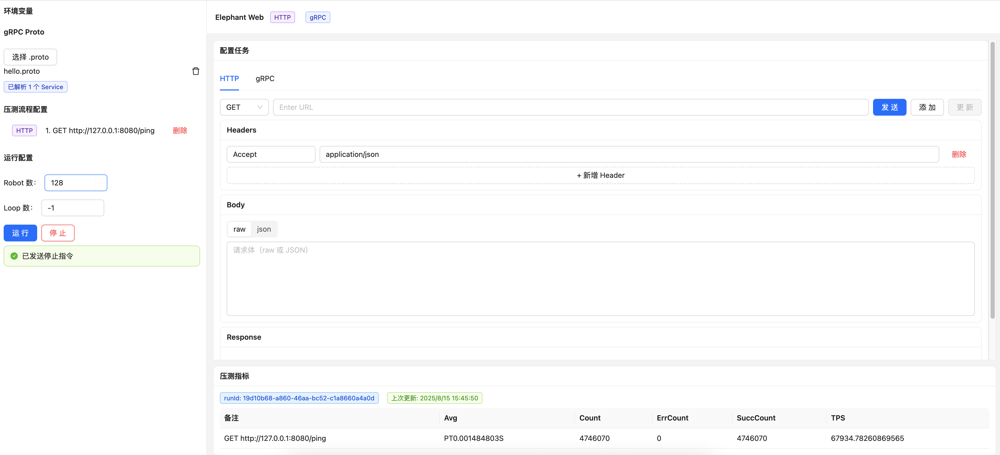

# 简介

基于Java VirtualThread 实现高性能, 分布式, 支持HTTP, Grpc等主流请求协议 支持流程化配置压测, 单机可以支持启动上万Robot数量,
一个机器人在一个协程中驱动,
相比Jmeter这种线程驱动压测会轻量很多, 由于HTTP, Grpc等都是网络IO请求, 协程驱动会更加有优势.

- 支持流程化编排
- 提供WEB可视化界面
- 支持变量表达式模版
- 动态解析Proto执行Grpc

# Preview

http://47.99.126.118:8080/

# 运行

clone项目, 运行, 打开http://localhost:8080 就可以看到压测前端界面了

# 界面

## 主配置

## gRPC

## HTTP

## 压测指标

